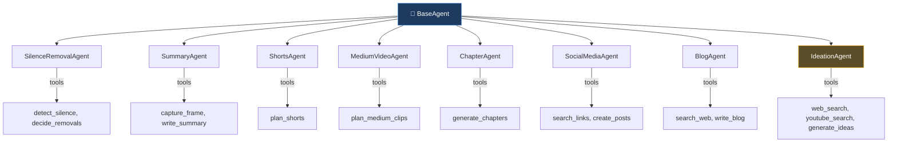

<div align="center">

```
 ██╗   ██╗██╗██████╗ ██████╗ ██╗██████╗ ███████╗
 ██║   ██║██║██╔══██╗██╔══██╗██║██╔══██╗██╔════╝
 ██║   ██║██║██║  ██║██████╔╝██║██████╔╝█████╗  
 ╚██╗ ██╔╝██║██║  ██║██╔═══╝ ██║██╔═══╝ ██╔══╝  
  ╚████╔╝ ██║██████╔╝██║     ██║██║     ███████╗
   ╚═══╝  ╚═╝╚═════╝ ╚═╝     ╚═╝╚═╝     ╚══════╝
```

**Your AI video editor and content ideation engine — turn raw recordings into shorts, reels, captions, social posts, and blog posts. Ideate, record, edit, publish.**

An agentic video editor and content ideation platform that watches for new recordings and edits them into social-media-ready content — shorts, reels, captions, blog posts, and platform-tailored social posts — using [GitHub Copilot SDK](https://github.com/github/copilot-sdk) AI agents, OpenAI Whisper, and Google Gemini.

[](https://github.com/htekdev/vidpipe/actions/workflows/ci.yml)
[](https://www.npmjs.com/package/vidpipe)
[](https://nodejs.org/)
[](./LICENSE)
[](https://htekdev.github.io/vidpipe/)
[](.)

</div>

```bash
npm install -g vidpipe
```

---

## ✨ Features

<p align="center">
  
</p>

<br />

<table>
  <tr>
    <td>💡 <b>Content Ideation (ID8)</b> — AI-generated, trend-backed video ideas</td>
    <td>🎙️ <b>Whisper Transcription</b> — Word-level timestamps</td>
  </tr>
  <tr>
    <td>📐 <b>Split-Screen Layouts</b> — Portrait, square, and feed</td>
    <td>🔇 <b>AI Silence Removal</b> — Context-aware, capped at 20%</td>
  </tr>
  <tr>
    <td>💬 <b>Karaoke Captions</b> — Word-by-word highlighting</td>
    <td>✂️ <b>Short Clips</b> — Best 15–60s moments, hook-first ordering</td>
  </tr>
  <tr>
    <td>🎞️ <b>Medium Clips</b> — 1–3 min with crossfade transitions</td>
    <td>📑 <b>Chapter Detection</b> — JSON, Markdown, YouTube, FFmeta</td>
  </tr>
  <tr>
    <td>📱 <b>Social Posts</b> — TikTok, YouTube, Instagram, LinkedIn, X</td>
    <td>📰 <b>Blog Post</b> — Dev.to style with web-sourced links</td>
  </tr>
  <tr>
    <td>🎨 <b>Brand Voice</b> — Custom tone, hashtags via brand.json</td>
    <td>🔍 <b>Face Detection</b> — ONNX-based webcam cropping</td>
  </tr>
  <tr>
    <td>🚀 <b>Auto-Publish</b> — Scheduled posting via Late API</td>
    <td>👁️ <b>Gemini Vision</b> — AI video analysis and scene detection</td>
  </tr>
</table>

---

## 🚀 Quick Start

```bash
# Install globally
npm install -g vidpipe

# Set up your environment
# Unix/Mac
cp .env.example .env
# Windows (PowerShell)
Copy-Item .env.example .env

# Then edit .env and add your OpenAI API key (REQUIRED):
#   OPENAI_API_KEY=sk-your-key-here

# Verify all prerequisites are met
vidpipe --doctor

# Process a single video
vidpipe /path/to/video.mp4

# Watch a folder for new recordings
vidpipe --watch-dir ~/Videos/Recordings

# Generate a saved idea bank for future recordings
vidpipe ideate --topics "GitHub Copilot, Azure, TypeScript" --count 4

# Full example with options
vidpipe \
  --watch-dir ~/Videos/Recordings \
  --output-dir ~/Content/processed \
  --openai-key sk-... \
  --brand ./brand.json \
  --verbose
```

> **Prerequisites:**
> - **Node.js 20+**
> - **FFmpeg 6.0+** — Auto-bundled on common platforms (Windows x64, macOS, Linux x64) via [`ffmpeg-static`](https://www.npmjs.com/package/ffmpeg-static). On other architectures, install system FFmpeg (see [Troubleshooting](#troubleshooting)). Override with `FFMPEG_PATH` env var if you need a specific build.
> - **OpenAI API key** (**required**) — Get one at [platform.openai.com/api-keys](https://platform.openai.com/api-keys). Needed for Whisper transcription and all AI features.
> - **GitHub Copilot subscription** — Required for AI agent features (shorts generation, social media posts, summaries, blog posts). See [GitHub Copilot](https://github.com/features/copilot).
>
> See [Getting Started](./docs/getting-started.md) for full setup instructions.

---

## 🎮 CLI Usage

```
vidpipe [options] [video-path]
vidpipe init              # Interactive setup wizard
vidpipe review            # Open post review web app
vidpipe schedule          # View posting schedule
vidpipe realign           # Realign scheduled posts to match schedule.json
vidpipe ideate            # Generate or list saved content ideas
vidpipe chat              # Interactive schedule management agent
vidpipe doctor            # Check all prerequisites
```

### Process Options

| Option | Description |
|--------|-------------|
| `[video-path]` | Process a specific video file (implies `--once`) |
| `--watch-dir <path>` | Folder to watch for new recordings |
| `--output-dir <path>` | Output directory (default: `./recordings`) |
| `--openai-key <key>` | OpenAI API key |
| `--exa-key <key>` | Exa AI key for web search in social posts |
| `--brand <path>` | Path to `brand.json` (default: `./brand.json`) |
| `--ideas <ids>` | Comma-separated idea IDs to link to this video |
| `--once` | Process next video and exit |
| `--no-silence-removal` | Skip silence removal |
| `--no-shorts` | Skip short clip extraction |
| `--no-medium-clips` | Skip medium clip generation |
| `--no-social` | Skip social media posts |
| `--no-social-publish` | Skip social media queue-build stage |
| `--no-captions` | Skip caption generation/burning |
| `--no-git` | Skip git commit/push |
| `--late-api-key <key>` | Override Late API key |
| `-v, --verbose` | Debug-level logging |
| `--doctor` | Check that all prerequisites are installed |

### Ideate Options

| Option | Description |
|--------|-------------|
| `--topics <topics>` | Comma-separated seed topics for trend research |
| `--count <n>` | Number of ideas to generate (default: 5) |
| `--list` | List existing ideas instead of generating |
| `--status <status>` | Filter by status: `draft`, `ready`, `recorded`, `published` |
| `--format <format>` | Output format: `table` (default) or `json` |
| `--output <dir>` | Ideas directory (default: `./ideas`) |
| `--brand <path>` | Brand config path (default: `./brand.json`) |

---

## 📁 Output Structure

```
recordings/
└── my-awesome-demo/
    ├── my-awesome-demo.mp4                  # Original video
    ├── my-awesome-demo-edited.mp4           # Silence-removed
    ├── my-awesome-demo-captioned.mp4        # With burned-in captions
    ├── transcript.json                      # Word-level transcript
    ├── transcript-edited.json               # Timestamps adjusted for silence removal
    ├── README.md                            # AI-generated summary with screenshots
    ├── captions/
    │   ├── captions.srt                     # SubRip subtitles
    │   ├── captions.vtt                     # WebVTT subtitles
    │   └── captions.ass                     # Advanced SSA (karaoke-style)
    ├── shorts/
    │   ├── catchy-title.mp4                 # Landscape base clip
    │   ├── catchy-title-captioned.mp4       # Landscape + burned captions
    │   ├── catchy-title-portrait.mp4        # 9:16 split-screen
    │   ├── catchy-title-portrait-captioned.mp4  # Portrait + captions + hook overlay
    │   ├── catchy-title-feed.mp4            # 4:5 split-screen
    │   ├── catchy-title-square.mp4          # 1:1 split-screen
    │   ├── catchy-title.md                  # Clip metadata
    │   └── catchy-title/
    │       └── posts/                       # Per-short social posts (5 platforms)
    ├── medium-clips/
    │   ├── deep-dive-topic.mp4              # Landscape base clip
    │   ├── deep-dive-topic-captioned.mp4    # With burned captions
    │   ├── deep-dive-topic.md               # Clip metadata
    │   └── deep-dive-topic/
    │       └── posts/                       # Per-clip social posts (5 platforms)
    ├── chapters/
    │   ├── chapters.json                    # Structured chapter data
    │   ├── chapters.md                      # Markdown table
    │   ├── chapters.ffmetadata              # FFmpeg metadata format
    │   └── chapters-youtube.txt             # YouTube description timestamps
    └── social-posts/
        ├── tiktok.md                        # Full-video social posts
        ├── youtube.md
        ├── instagram.md
        ├── linkedin.md
        ├── x.md
        └── devto.md                         # Dev.to blog post
```

---

## 💡 Content Ideation (ID8)

VidPipe includes a research-backed content ideation engine that generates video ideas before you record. Ideas are stored as GitHub Issues for full lifecycle tracking.

```bash
# Generate ideas backed by trend research
vidpipe ideate --topics "GitHub Copilot, TypeScript" --count 4

# List all saved ideas
vidpipe ideate --list

# Filter by status
vidpipe ideate --list --status ready

# JSON output for programmatic access (e.g., VidRecord integration)
vidpipe ideate --list --format json

# Link ideas to a recording
vidpipe process video.mp4 --ideas 12,15
```

### How It Works

The **IdeationAgent** uses MCP tools (Exa web search, YouTube, Perplexity) to research trending topics in your niche before generating ideas. Each idea includes:

- **Topic & hook** — The angle that makes it compelling
- **Audience & key takeaway** — Who it's for and what they'll learn
- **Talking points** — Structured bullet points to guide your recording
- **Publish-by date** — Based on timeliness (3–5 days for hot trends, months for evergreen)
- **Trend context** — The research findings that back the idea

### Idea Lifecycle

```
draft → ready → recorded → published
```

| Status | Meaning |
|--------|---------|
| `draft` | Generated by AI, awaiting your review |
| `ready` | Approved — ready to record |
| `recorded` | Linked to a video via `--ideas` flag |
| `published` | Content from this idea has been published |

Ideas automatically influence downstream content — when you link ideas to a recording with `--ideas`, the pipeline's agents (shorts, social posts, summaries, blog) reference your intended topic and hook for more focused output.

---

## 📺 Review App

VidPipe includes a built-in web app for reviewing, editing, and scheduling social media posts before publishing.

<div align="center">
  
  <br />
  <em>Review and approve posts across YouTube, TikTok, Instagram, LinkedIn, and X/Twitter</em>
</div>

```bash
# Launch the review app
vidpipe review
```

- **Platform tabs** — Filter posts by platform (YouTube, TikTok, Instagram, LinkedIn, X)
- **Video preview** — See the video thumbnail and content before approving
- **Keyboard shortcuts** — Arrow keys to navigate, Enter to approve, Backspace to reject
- **Smart scheduling** — Posts are queued with optimal timing per platform

---

## 🔄 Pipeline


```mermaid
graph LR
    A[📥 Ingest] --> B[🎙️ Transcribe]
    B --> C[🔇 Silence Removal]
    C --> D[💬 Captions]
    D --> E[🔥 Caption Burn]
    E --> F[✂️ Shorts]
    F --> G[🎞️ Medium Clips]
    G --> H[📑 Chapters]
    H --> I[📝 Summary]
    I --> J[📱 Social Media]
    J --> K[📱 Short Posts]
    K --> L[📱 Medium Posts]
    L --> M[📰 Blog]
    M --> N[📦 Queue Build]
    N --> O[🔄 Git Push]

    style A fill:#2d5a27,stroke:#4ade80
    style B fill:#1e3a5f,stroke:#60a5fa
    style E fill:#5a2d27,stroke:#f87171
    style F fill:#5a4d27,stroke:#fbbf24
    style O fill:#2d5a27,stroke:#4ade80
```

| # | Stage | Description |
|---|-------|-------------|
| 1 | **Ingestion** | Copies video, extracts metadata with FFprobe |
| 2 | **Transcription** | Extracts audio → OpenAI Whisper for word-level transcription |
| 3 | **Silence Removal** | AI detects dead-air segments; context-aware removals capped at 20% |
| 4 | **Captions** | Generates `.srt`, `.vtt`, and `.ass` subtitle files with karaoke word highlighting |
| 5 | **Caption Burn** | Burns ASS captions into video (single-pass encode when silence was also removed) |
| 6 | **Shorts** | AI identifies best 15–60s moments; extracts single and composite clips with 6 variants per short |
| 7 | **Medium Clips** | AI identifies 1–3 min standalone segments with crossfade transitions |
| 8 | **Chapters** | AI detects topic boundaries; outputs JSON, Markdown, FFmetadata, and YouTube timestamps |
| 9 | **Summary** | AI writes a Markdown README with captured screenshots |
| 10 | **Social Media** | Platform-tailored posts for TikTok, YouTube, Instagram, LinkedIn, and X |
| 11 | **Short Posts** | Per-short social media posts for all 5 platforms |
| 12 | **Medium Clip Posts** | Per-medium-clip social media posts for all 5 platforms |
| 13 | **Blog** | Dev.to blog post with frontmatter, web-sourced links via Exa |
| 14 | **Queue Build** | Builds publish queue from social posts with scheduled slots |
| 15 | **Git Push** | Auto-commits and pushes to `origin main` |

Each stage can be independently skipped with `--no-*` flags. A stage failure does not abort the pipeline — subsequent stages proceed with whatever data is available.

---

## 🤖 LLM Providers

VidPipe supports multiple LLM providers:

| Provider | Env Var | Default Model | Notes |
|----------|---------|---------------|-------|
| `copilot` (default) | — | Claude Opus 4.6 | Uses GitHub Copilot auth |
| `openai` | `OPENAI_API_KEY` | gpt-4o | Direct OpenAI API |
| `claude` | `ANTHROPIC_API_KEY` | claude-opus-4.6 | Direct Anthropic API |

Set `LLM_PROVIDER` in your `.env` or pass via CLI. Override model with `LLM_MODEL`.

The pipeline tracks token usage and estimated cost across all providers, displaying a summary at the end of each run.

---

## ⚙️ Configuration

Configuration is loaded from CLI flags → environment variables → `.env` file → defaults.

```env
# .env
OPENAI_API_KEY=sk-your-key-here
WATCH_FOLDER=/path/to/recordings
OUTPUT_DIR=/path/to/output
# EXA_API_KEY=your-exa-key       # Optional: enables web search in social/blog posts
# BRAND_PATH=./brand.json         # Optional: path to brand voice config
# FFMPEG_PATH=/usr/local/bin/ffmpeg
# FFPROBE_PATH=/usr/local/bin/ffprobe
# LATE_API_KEY=sk_your_key_here   # Optional: Late API for social publishing
# GITHUB_TOKEN=ghp_...            # Optional: GitHub token for ID8 idea storage
# IDEAS_REPO=owner/repo           # Optional: GitHub repo for storing ideas as Issues
```

Social media publishing is configured via `schedule.json` and the Late API. See [Social Publishing Guide](./docs/social-publishing.md) for details.

---

## 📚 Documentation

| Guide | Description |
|-------|-------------|
| [Getting Started](./docs/getting-started.md) | Prerequisites, installation, and first run |
| [Configuration](./docs/configuration.md) | All CLI flags, env vars, skip options, and examples |
| [FFmpeg Setup](./docs/ffmpeg-setup.md) | Platform-specific install (Windows, macOS, Linux, ARM64) |
| [Brand Customization](./docs/brand-customization.md) | Customize AI voice, vocabulary, hashtags, and content style |
| [Social Publishing](./docs/social-publishing.md) | Review, schedule, and publish social posts via Late API |
| [Architecture (L0–L7)](./docs/architecture/layers.md) | Layer hierarchy, import rules, and testing strategy |
| [Platform Content Strategy](./docs/platform-content-strategy.md) | Research-backed recommendations per social platform |

Full reference docs are available at [htekdev.github.io/vidpipe](https://htekdev.github.io/vidpipe/).

---

## 🏗️ Architecture

VidPipe uses a strict **L0–L7 layered architecture** where each layer can only import from specific lower layers. This enforces clean separation of concerns and makes every layer independently testable.

```
L7-app         CLI, servers, watchers          → L0, L1, L3, L6
L6-pipeline    Stage orchestration             → L0, L1, L5
L5-assets      Lazy-loaded asset + bridges     → L0, L1, L4
L4-agents      LLM agents (BaseAgent)          → L0, L1, L3
L3-services    Business logic + cost tracking  → L0, L1, L2
L2-clients     External API/process wrappers   → L0, L1
L1-infra       Infrastructure (config, logger) → L0
L0-pure        Pure functions, zero I/O        → (nothing)
```

Each editing task is handled by a specialized AI agent built on the [GitHub Copilot SDK](https://github.com/github/copilot-sdk):


```mermaid
graph TD
    BP[🧠 BaseAgent] --> SRA[SilenceRemovalAgent]
    BP --> SA[SummaryAgent]
    BP --> SHA[ShortsAgent]
    BP --> MVA[MediumVideoAgent]
    BP --> CA[ChapterAgent]
    BP --> SMA[SocialMediaAgent]
    BP --> BA[BlogAgent]
    BP --> IA[IdeationAgent]

    SRA -->|tools| T1[detect_silence, decide_removals]
    SHA -->|tools| T2[plan_shorts]
    MVA -->|tools| T3[plan_medium_clips]
    CA -->|tools| T4[generate_chapters]
    SA -->|tools| T5[capture_frame, write_summary]
    SMA -->|tools| T6[search_links, create_posts]
    BA -->|tools| T7[search_web, write_blog]
    IA -->|tools| T8[web_search, youtube_search, generate_ideas]

    style BP fill:#1e3a5f,stroke:#60a5fa,color:#fff
    style IA fill:#5a4d27,stroke:#fbbf24,color:#fff
```

Each agent communicates with the LLM through structured tool calls, ensuring reliable, parseable outputs. See the [Architecture Guide](./docs/architecture/layers.md) for full details on layer rules and import enforcement.

---

## 🛠️ Tech Stack

| Technology | Purpose |
|------------|---------|
| [TypeScript](https://www.typescriptlang.org/) | Language (ES2022, ESM) |
| [GitHub Copilot SDK](https://github.com/github/copilot-sdk) | AI agent framework |
| [OpenAI Whisper](https://platform.openai.com/docs/guides/speech-to-text) | Speech-to-text |
| [Google Gemini](https://ai.google.dev/) | Vision-based video analysis |
| [FFmpeg](https://ffmpeg.org/) | Video/audio processing |
| [Sharp](https://sharp.pixelplumbing.com/) | Image analysis (webcam detection) |
| [Octokit](https://github.com/octokit/octokit.js) | GitHub API (idea storage as Issues) |
| [Commander.js](https://github.com/tj/commander.js) | CLI framework |
| [Chokidar](https://github.com/paulmillr/chokidar) | File system watching |
| [Winston](https://github.com/winstonjs/winston) | Logging |
| [Exa AI](https://exa.ai/) | Web search for social posts, blog, and ideation |

---

## 🗺️ Roadmap

- [x] **Automated social posting** — Publish directly to platforms via Late API
- [x] **Content ideation (ID8)** — AI-generated, trend-backed video ideas with lifecycle tracking
- [x] **Gemini Vision integration** — AI-powered video analysis and scene detection
- [x] **L0–L7 layered architecture** — Strict separation of concerns with import enforcement
- [x] **GitHub agentic workflows** — Automated issue and PR triage via GitHub Actions
- [x] **Hook-first clip ordering** — Most engaging moment plays first in shorts
- [ ] **Multi-language support** — Transcription and summaries in multiple languages
- [ ] **Custom templates** — User-defined Markdown & social post templates
- [ ] **Batch processing** — Process an entire folder of existing videos
- [ ] **Thumbnail generation** — Auto-generate branded thumbnails for shorts

---

## 🔧 Troubleshooting

### `No binary found for architecture` during install

`ffmpeg-static` (an optional dependency) bundles FFmpeg for common platforms. On unsupported architectures, it skips gracefully and vidpipe falls back to your system FFmpeg.

**Fix:** Install FFmpeg on your system:
- **Windows:** `winget install Gyan.FFmpeg`
- **macOS:** `brew install ffmpeg`
- **Linux:** `sudo apt install ffmpeg` (Debian/Ubuntu) or `sudo dnf install ffmpeg` (Fedora)

You can also point to a custom binary: `export FFMPEG_PATH=/path/to/ffmpeg`

Run `vidpipe doctor` to verify your setup.

---

## 📄 License

ISC © [htekdev](https://github.com/htekdev)

---

## 🧩 SDK Usage

VidPipe also ships as a Node.js ESM SDK for programmatic use:

```ts
import { createVidPipe } from 'vidpipe'

const vidpipe = createVidPipe({
  openaiApiKey: process.env.OPENAI_API_KEY,
  outputDir: './recordings',
})

const result = await vidpipe.processVideo('./videos/demo.mp4', {
  skipGit: true,
})

console.log(result.video.videoDir)
console.log(result.shorts.length)
```

SDK features include:

- `processVideo()` for the full pipeline
- `ideate()` plus `ideas.*` CRUD helpers
- `schedule.*` helpers for slots, calendar, and realignment
- `video.*` helpers for clips, captions, silence detection, variants, and frames
- `social.generatePosts()` for quick platform-specific drafts
- `doctor()` and `config.*` for diagnostics and configuration access

See [docs/sdk.md](./docs/sdk.md) for the full SDK guide.

